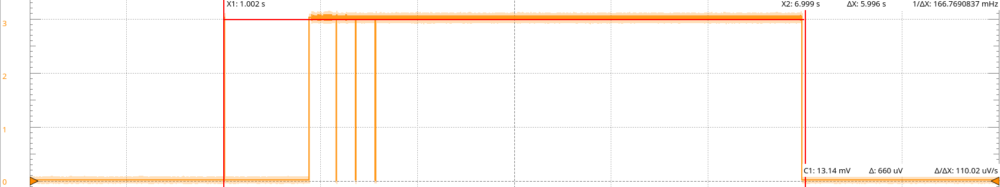

# Shimano BT-E6000 BMS PCB
My old Shimano BT-E6000 battery gave up on me a couple of years back and I always wanted to check out what killed it. I did not get around to do that and seeing a custom IC on the back of the PCB I got to tracing the hole pcb to try and figure out how it all ticks.

Right now I traced most of it, and the KiCAD project contains a messy schematic file. I hope to continue my work on it, but I wanted to put what I've done on here if I lose interest and perhaps to catch some of the mistakes I've made.

## Notes
### UART message format
PP LL (DD .. DD) CC CC

PP: header, with counter.  
LL: message/data length  
DD: Optional data, according to LL  
CC: Two byte CRC, calculated over all bytes before it.

#### What if first non zero byte is a bitfield?

FROM BATTERY:   
hC1 => 11000001  
h82 => 10000010

FROM CHARGER:  
h41 => 01000001  
h02 => 00000010

FROM DISPLAY:  
h40 => 01000000  

B H ? ? ? ? C C

B: Battery flag ?  
H: Header flag ?  
C: 2 bit message counter ?  

#### FROM BATTERY

h00 h80 h16 h10 h00 h02 h00 h00 h00 hFD h9F h08 h20 hFA h1F h18 h18 h18 ***h5C*** h00 h00 h00 h00 h00 h00 h53 h09 

- 15th data byte could be Battery Level (in %)

#### CRC
The first h00 is not part of the message! It possible could be the end of frame marker see the end of [BATT_RX_ON_BIKE_TIME_OUT_004.txt](RXTXRecords/BATT_RX_ON_BIKE_TIME_OUT_004.txt). The file ends with h00. I framed it wrong from the start.

Not including the first h00 gives me a consistent CRC "CRC-16/IBM-SDLC"

It seems to fit even the headers! Should test a bit more, but the fact that it fits the headers is a big plus.

Great, that's one thing of the checklist.

**cyberchef recipe**  

>Find_/_Replace({'option':'Regex','string':'h'},'',true,false,true,false)
>Fork('\\n','\\n',false)
>From_Hex('Auto')
>CRC_Checksum('CRC-16/IBM-SDLC',{'option':'Decimal','string':'0'},{'option':'Hex','string':'0'},{'option':'Hex','string':'0'},'True','True',{'option':'Hex','string':'0'})

### Varia
- Turning on the battery to check level with led lights on the side triggers a 3.3v pulse on BAT_TX
- Pressing the button on the display unit puts a long pulse of around 6.4v on pins.
- Pressing the button on the display unit puts a 6 second sequence on the BAT_RX pin.

 

### Possible Charging Initialization

TX Pin on charger provides 3.3V when connected to Battery RX pin.

1. RX at 3.3V to GND ==> comfirmed
2. Q024 (NPN) triggers
3. Q002 (PNP) triggers
4. Battery+ (BAT_P) or Pack+ (PACK_P) via common cathode diode (D004) provide 36v to LDO (IC002)
5. LDO powers MCU (IC003)
6. MCU initializes, but before any communication PIN19 has to go high to take over triggering Q024.

IC003 is constantly powered, System can be bootstrapped by pulling RX high (3.3v)

### Possible Battery Initialization

RX at 3.3V to GND for 6 seconds, after first 280 ms 3 burts of UART message "h00 h40 h00 h21 h49" two next burst come 200ms after eachother.

### IC003

| PIN | DIRECTION | NOTE |
|--|--|--|
| 01 | OUT | Enable led D009
| 02 | OUT | Enable led D008
| 03 | IN (ADC)| Connected to IC001 VOUT, monitors Cell or Pack voltage. 
| 04 | IN (ADC)| Thermistor TH002 - SMD next to MOSFETS
| 05 | IN (ADC)| Thermistor TH003 - Between batteries
| 06 | IN (ADC)| Thermistor TH004 - TH
| 07 | ? | Capacitor to GND
| 08 | ? | Capacitor to GND
| 09 | ? | Capacitor to GND
| 10 | POWER | GND
| 11 |  | NC
| 12 | OUT | Enable Charging
| 13 | OUT | Enable Discharging
| 14 | IN | Connected to IC001 XALERT, L == ALERT
| 15 | ? | Unclear
| 16 | OUT | Enable PACK_P to IC001 PACK pin.
| 17 |  | NC
| 18 | OUT | Enable BAT_P to IC001 PACK pin
| 19 | OUT | Enables BAT_P or PACK_P to LDO (IC002)
| 20 |  | NC
| 21 | OUT | Enable IC001 EEPROM writing
| 22 | OUT | Puts 3.3V on TX of pack (?)
| 23 | IN | Flag to check if TX is high. Possibly used to verify pin 22 or to check if TX is beeing pulled low externally. (?)
| 24 | OUT | Enable led D012
| 25 | POWER | GND
| 26 | POWER | 3.3V
| 27 |  | RX-TX things still to figure out/review
| 28 |  | RX-TX things still to figure out/review
| 29 |  | TP - Unclear
| 30 |  | NC (?)
| 31 |  | RX-TX things still to figure out/review
| 32 |  | RX-TX things still to figure out/review
| 33 | IN | ON/OFF Button
| 34 | OUT | I2C Clock
| 35 | IO | I2C Data
| 36 |  | TP - Unclear
| 37 | OUT  | Enable led D011
| 38 |  | NC
| 39 |  | NC
| 40 |  | NC
| 41 |  | NC
| 42 |  | NC
| 43 |  | NC
| 44 |  | NC
| 45 |  | NC
| 46 |  | NC
| 47 |  | NC
| 48 | OUT | Enable led D010